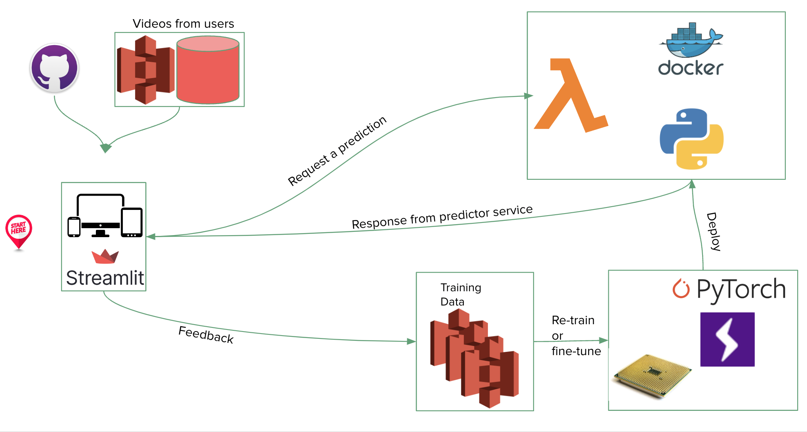

# ASL Word Recognizer App

This repository contains the code to run a Streamlit app that takes in a video URL/file containing a person doing a sign, and it returns the predicted word/text for that sign. Currently this works at the word-level only. 

**Demo App:** [https://gesto-ai-model-serve-app-video-app-vs3664.streamlitapp.com/](https://gesto-ai-model-serve-app-video-app-vs3664.streamlitapp.com/)  
**Demo Video:** [https://youtu.be/TuRSicQgn68](https://youtu.be/TuRSicQgn68)  

**Model:** [Inception I3D](https://github.com/deepmind/kinetics-i3d)

**Dataset:** Word-Level American Sign Language ([WLASL homepage](https://dxli94.github.io/WLASL/))

**System Diagram:**

- Data is stored in AWS S3.
- The model service is packaged and served on an AWS Lambda function.
- The UI/frontend is hosted on Streamlit.
- There's a user feedback collection feature that stores user predictions in a CSV file in AWS S3.



For more information, take a look at our presentation [slides](https://docs.google.com/presentation/d/1CiP4QLu5_bdibrZnjJygrSOjV-iFaqD7irHi4fD6CJc/edit?usp=sharing).

Built for the 2022 Full Stack Deep Learning (FSDL) class by Shivam Arora, Daniel Firebanks, Pablo Oberhauser, Dhruv Shah, Ibrahim Sherif, and Samuel Tang. 

## Pre-requisites

- Python 3.9
- A virtual environment

In a virtual environment (this was tested in a `conda` environment), install the required packages from the `requirements.txt` file:
```
pip install -r requirements.txt
```

## Using the Sign Recognizer app

### Step 1: Get the model weights

The script currently expects the model weights to be stored in `model_serve/artifacts/sign-recognizer/model.pt`. You can download the model weights from [here](https://drive.google.com/file/d/1KVGkt-A3mRBC4Nu3Vty7uhOqr87tydwB/view?usp=sharing)


### Step 2: Running the Streamlit app locally

```
streamlit run app.py
```

## [INTERNAL] Building and testing the backend prediction server
We can test the prediction server logic without deploying to AWS. **NOTE:** If you run this in your local machine, it will probably timeout - so make sure to run it in a GPU-powered machine!

0. First, comment out the line `include .env` in the Makefile, unless you have a `.env` file with the expected information.
1. Build the docker image
```
# If you're on an M1 mac, run `make build_m1` instead
make build
```
2. Run the container locally
```
make run
```
3. In a different terminal session, run a local test with the demo video by sending a POST request to the running container.

```
make test_local
```

## Deploy model code to AWS ECR/Lambda

Sources: 
- [Creating Lambda container images](https://docs.aws.amazon.com/lambda/latest/dg/images-create.html)
- [Deploying Lambda functions as container images](https://docs.aws.amazon.com/lambda/latest/dg/gettingstarted-images.html)
- [Notebook with detailed steps to deploy to AWS Lambda](https://github.com/full-stack-deep-learning/fsdl-text-recognizer-2022/blob/main/notebooks/lab99_serverless_aws.ipynb)

### Running the deploy process from start to finish (Currently not supported unless you have an AWS acccount connected)

Pre-pre requisites:
- Have an AWS account, with a secret key/secret access key

Pre-requisites (for the `sign-recognizer` app, these have already been created):
- Create a repository in the AWS Elastic Container Registry (ECR)
```
make create_ecr_repository
```
- Create an AWS Lambda function (will take a bit and may ran into timeouts)
```
make create_lambda
```

The following commands will:
- Build a Docker image
- Push it to AWS ECR
- Update the Lambda function with the newest image
- Get the status of the Lambda function update


- If you’re on an M1 Mac, run:
```
make full_lambda_deploy_m1
```
- Else, run:
```
make full_lambda_deploy
```
